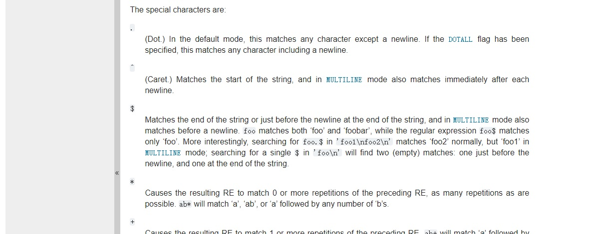

# A second round of developing this page 2

In the last update earlier this evening, actually it was doing copy the given Markdown to a destination and rename it. I thought it was fine if it includes an image because I can simply have a check. Soon after that I realized that I should make the script also be able to distribute the mentioned image in Markdown file. If using a local image file, then also copy the image to correct location and rename it.  

Meanwhile, if I'm referring an online location  by an HTTPS URL, then just leave it unchanged.

Jun. 13, 2020