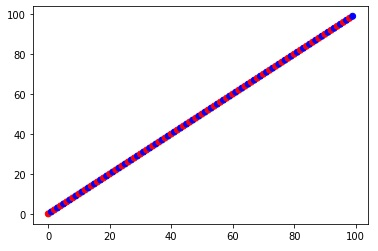
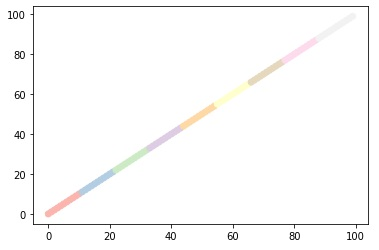
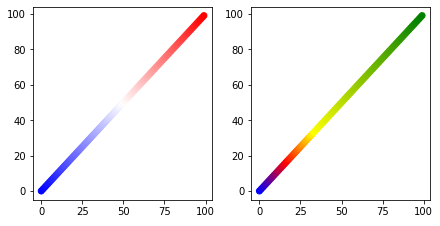

# Create Colormap (cmap) for Matplotlib
When plotting, people definitely care about the color of the dots in there scatter plots. 
```python
import matplotlib.pyplot as plt
# For example, the 2-D data we want to plot comes this way
x, y = list(range(100)), list(range(100))
```
Usually there are two ways to set this feature:  

## Set with exact color label for each point
Know the exact color representation of each dot and give it to `color` argument
```python
plt.scatter(x, y, color=['red', 'blue']*50)
plt.show()
```

Note that you can also say `color='red'` for set all dots to "red".  
This way is usually used when you have run some sort of unsupervised learning on your dataset, and in result you get a list of label for the sample points. Then you will usually plot the top variable components of your dataset, and throw the list of label to `color`. 
## Project continuous values to `cmap`
When you have some sort of continuous value, and you want a color gradient to reflect the value, set `c` to this value and use `cmap` to choose the color palette.  
```python
c = list(range(100))
plt.scatter(x, y, c=c, cmap='Pastel1')
plt.show()
```

A classic scenario is that in Bioinformatics, when you have a PCA embedding of a set of samples and you plot the top two components as the `x` and `y` dimension, and then you want to use the color to represent the expression level of a gene of interests for these samples, you can directly throw the array of expression value to `c`.  
## Implementation of more flexible `cmap`
However, though there has already been a long list of preset colormaps in matplotlib (use `dir(matplotlib.cm)` to have a quick look, this also gives you other functions and constants though), I still think it's good to have an access to define customized colormap with maximum flexibility. Therefore, I wrote myself a simple script for this functionality, which you can find [here](https://github.com/mvfki/assignments/blob/master/matplotlib_cmap_generator.py). Detailed documents and usage has already been stated in the script. Let's have a quick check on the example data above.  
```python
import generateCmap from matplotlib_cmap_generator
cmap1 = generateCmap(['blue', 'white', 'red'])
cmap2 = generateCmap(['blue', 'red', 'yellow', 'green'], [0, 1, 2, 6])
cms = [cmap1, cmap2]
fig, axs = plt.subplots(1, 2, figsize=(6, 3), constrained_layout=True)
for [ax, cmap] in zip(axs, cms):
    ax.scatter(x, y, c=x, cmap=cmap)
plt.show()
```

So the point of this function is that, you can set gradients varying from any colors you have in mind, and you can set as many colors as you can identify. Furthermore, the width of the interval of each gradient can also be set by the second argument, which stands for the relative value that each color should occur.  

Jul. 1st, 2020  
