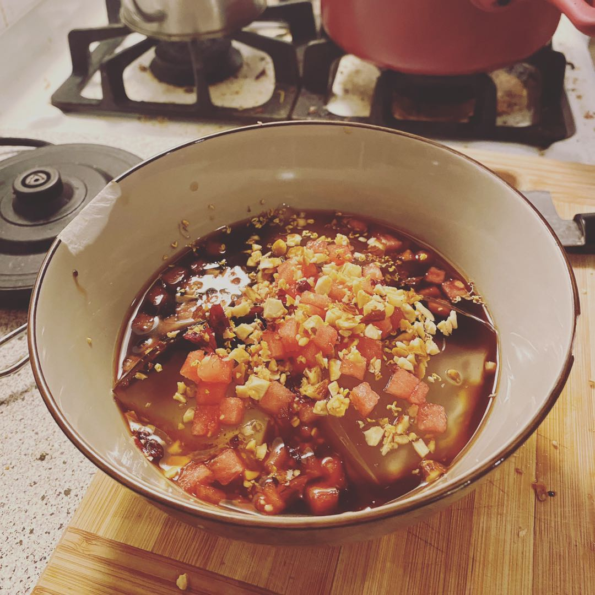

# Bingfen - Nicandra Jelly, Sichuan traditional dessert

At the end of the boring summer that we are all working from home, I finally made the nostalgic dessert, that people would always have in the summer in my hometown.  

First let me briefly introduce what it is. The key ingredient is the jelly that you can see, buried under the toppings in the picture. The jelly is made of the grounded powder of nicandra, a type of plant. The jelly itself does not have any flavor or color. The only good thing I would say is, it brings you a cooling and refreshing taste. The second ingredient, which is also the most important partner for the jelly, is the brown sugar soup. You just need to simply dissolve the traditional Chinese brown sugar into cold water to make it. It is sugar so it brings you the sweetness. While it is not pure white sugar, it has some magic special flavors as well.  

As for the toppings, there are a lot more to talk about. The most traditional options include small watermelon cubes, raisins, haw flakes and ground nuts. As you might can already tell, the combinations of these things would definitely bring you layerings of sense in multiple dimensions. The flavors, hardness and even temprature varies so much, yet they match each other so well.  

Though Bingfen is some sort of a traditional food, people keep creating new options and combinations for the toppings. This phenomenon is quietly becoming a fashion, similar to the milktea culture which is sweeping the East Asia. My favorite new toppings are dried osmanthus flower and sweet fermented rice (Contains alcohol! Warning to teens!). I really have to say, the first person who came up with the idea of adding these two is a genius, no matter this person added them intentionally or not. If you are lucky to have already known how fragrant osmanthus smells, you can trust me that you will fall in love the flavor it brings. Then for the sweet fermented rice, I cannot find a reason to refuse it, because I really like the smell and taste that the low concentration of alcohol and the fermentation of rice can give.  

>The moment I told my mom that I added dried osmanthus flower to my Bingfen, on a phone call, she yelled: "Yes, yes, yes! That is what you should add!"

